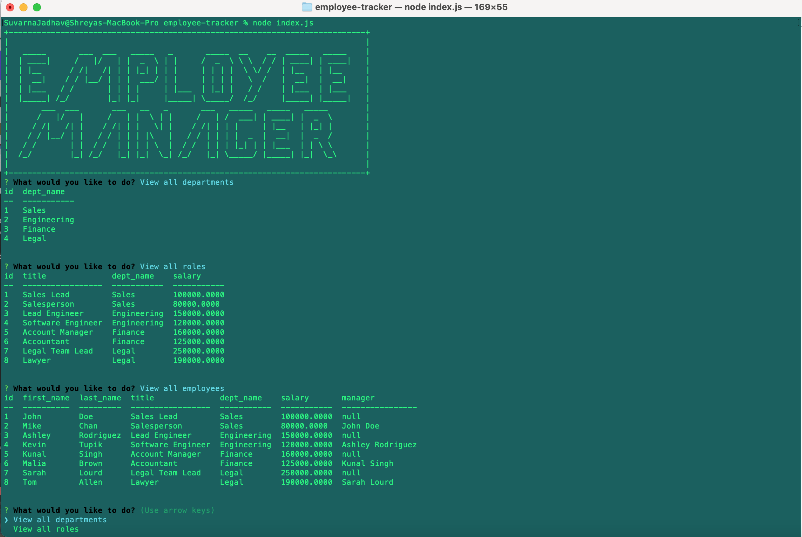

# employee-tracker

## Description 

This is a Node.js, Inquirer, and MySQL based command-line application to manage a company's employee database. This application will help you view and manage the departments, roles and employees in a company.

The application can be invoked by using 'node index.js' command. 

* Once invoked, you are presented with these options: view all departments, view all roles, view all employees, add a department, add a role, add an employee, and update an employee role.
* When you choose to view all departments then you are presented with a formatted table showing department names and department ids.
* When you choose to view all roles then I am presented with the job title, role id, the department that role belongs to, and the salary for that role.
* When you choose to view all employees then you are presented with a formatted table showing employee data, including employee ids, first names, last names, job titles, departments, salaries, and managers that the employees report to.
* When you choose to add a department then you are prompted to enter the name of the department and that department is added to the database.
* When you choose to add a role then you are prompted to enter the name, salary, and department for the role and that role is added to the database.
* When you choose to add an employee then you are prompted to enter the employee’s first name, last name, role, and manager, and that employee is added to the database.
* When you choose to update an employee role then you are prompted to select an employee to update and their new role and this information is updated in the database.
* When you choose to view total utilized budget of a department then you are prompted to select the department and then their total budget is displayed.
* When you choose to view employees by department then you are prompted to select the department and then the employees for that department are displayed.
* When you choose to view employees by manager then you are prompted to select the manager and then the employees reporting to that manager are displayed.
* When you choose to delete department then you are prompted to select the department and then that department is deleted from the database. 
* When you choose to delete role then you are prompted to select the role and then that role is deleted from the database. 
* When you choose to delete employee then you are prompted to select the employee and then that employee is deleted from the database. 

## Features

* The features are same as explained in the description, please refer above.
* In addition to that, the application has used 'console.table' to print MySQL rows to the console in table format.
* It also uses 'ascii-text-generator' and 'ascii-box' to display the application name in ascii format.
* It also uses .promise() function on connections to upgrade an existing non-Promise connection to use Promises.

## Installation

N/A

## Screenshot

## Link to the GitHub repo of the application

https://github.com/suvarna28/employee-tracker 

## Link to the walkthrough video demonstrating the functionality of the application

## Credits

* Our TA, Sebastian Fave for answering homework related doubts and helping in resolving query related questions. 
* Stackoverflow and W3schools for syntax and examples. 
* Ascii text generator package and example from npm, https://www.npmjs.com/package/ascii-text-generator 
